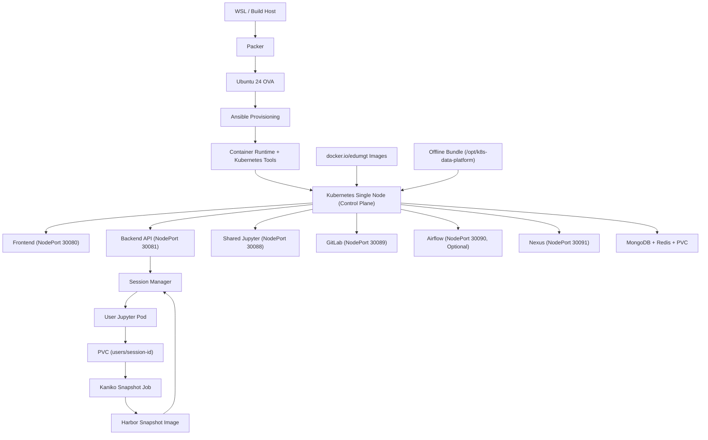
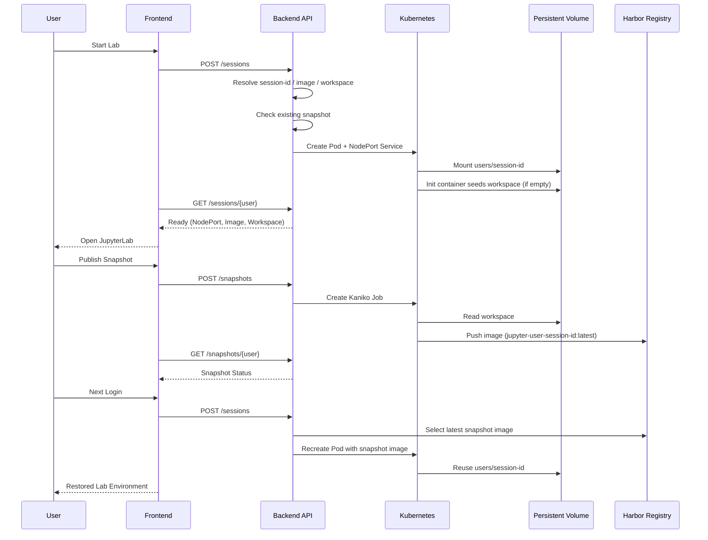
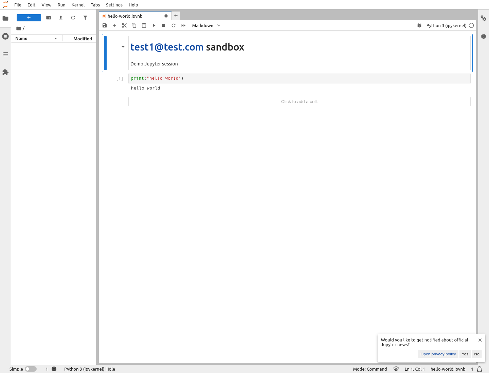
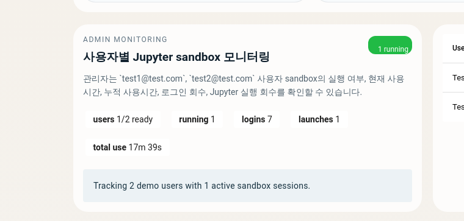

# k8s-data-platform-ova

이 저장소는 `Ubuntu 24 OVA -> kubeadm single-node Kubernetes -> platform workloads` 구조를 기준으로 만든 실습/운영용 플랫폼입니다. 현재 실행 기준은 Docker Compose 가 아니라 `Kubernetes manifest + kustomize overlay + kubeadm/bootstrap` 이며, OVA 안에 Docker Engine, containerd, kubeadm, kubelet, kubectl, vim, curl, Node.js, Python, 이미지 캐시, 오프라인 번들까지 미리 넣는 방향으로 정리했습니다.

핵심 요구 반영 사항은 아래와 같습니다.

- 사용자별 JupyterLab 세션을 Kubernetes Pod/Service 로 생성
- 사용자별 workspace 를 `PVC subPath` 로 지속화
- workspace 를 Kaniko Job 으로 Harbor snapshot 이미지화
- 다음 로그인 시 Harbor snapshot 이미지를 우선 선택해 재기동
- 플랫폼 공통 이미지는 `docker.io/edumgt/*` 에서 pull
- OVA 내부에 Docker Engine, 기본 유틸리티, 플랫폼 이미지, 오프라인 라이브러리 번들 선탑재

## Kubernetes 구조 확인

현재 구조는 Kubernetes 가 맞습니다.

- 호스트 런타임: `Ubuntu 24`
- 클러스터: `kubeadm` 기반 single-node Kubernetes
- 배포 기준: `infra/k8s/base` + `infra/k8s/overlays/dev|prod`
- 워크로드: `backend`, `frontend`, `mongodb`, `redis`, `airflow(optional)`, `jupyter`, `gitlab`, `gitlab-runner`, `nexus`
- 사용자 Jupyter 세션: backend 가 Kubernetes API 로 per-user Pod/Service 생성

즉, 이 저장소는 이미 Kubernetes 중심 구조였고, 이번 변경은 그 위에 `PVC subPath + snapshot publish/restore + registry/offline` 레이어를 보강한 것입니다.

## 구조 요약

```text
.
├── apps/
│   ├── airflow/          # Airflow image + DAG
│   ├── backend/          # FastAPI API + k8s session/snapshot control
│   ├── frontend/         # Quasar(Vue 3) dashboard
│   └── jupyter/          # JupyterLab image + bootstrap workspace
├── ansible/              # OVA guest provisioning, Docker/Kubernetes/bootstrap
├── infra/
│   ├── harbor/           # Harbor snapshot integration notes
│   └── k8s/              # base manifests + dev/prod overlays + runner overlay
├── packer/               # Ubuntu 24 OVA template
└── scripts/              # build/publish/apply/offline helper scripts
```

## 아키텍처 Flowchart



## Jupyter Snapshot Sequence



## 사용자별 세션 규칙

공통 식별자 규칙은 [apps/backend/app/services/lab_identity.py](apps/backend/app/services/lab_identity.py) 에 모았습니다.

- `username` 정규화
- `session_id` 생성
- `pod_name`
- `service_name`
- `workspace_subpath`
- Harbor snapshot image 경로

이 규칙을 바탕으로:

- [apps/backend/app/services/jupyter_sessions.py](apps/backend/app/services/jupyter_sessions.py)
  가 Pod/Service/PVC mount 를 관리하고,
- [apps/backend/app/services/jupyter_snapshots.py](apps/backend/app/services/jupyter_snapshots.py)
  가 Kaniko snapshot publish/status/restore image 선택을 담당합니다.

## 이미지 전략

플랫폼 기본 이미지와 서드파티 런타임 이미지는 모두 `docker.io/edumgt/*` 기준으로 맞췄습니다.

- platform app images
  - `docker.io/edumgt/k8s-data-platform-backend:latest`
  - `docker.io/edumgt/k8s-data-platform-frontend:latest`
  - `docker.io/edumgt/k8s-data-platform-airflow:latest`
  - `docker.io/edumgt/k8s-data-platform-jupyter:latest`
- mirrored runtime/base images
  - `docker.io/edumgt/platform-python:*`
  - `docker.io/edumgt/platform-node:*`
  - `docker.io/edumgt/platform-nginx:*`
  - `docker.io/edumgt/platform-mongodb:*`
  - `docker.io/edumgt/platform-redis:*`
  - `docker.io/edumgt/platform-gitlab-ce:*`
  - `docker.io/edumgt/platform-gitlab-runner:*`
  - `docker.io/edumgt/platform-kaniko-executor:*`

Harbor 는 플랫폼 공통 이미지 레지스트리가 아니라 `per-user Jupyter snapshot registry` 로만 사용합니다. Docker Hub `edumgt/*` 로 push 한 app/runtime 이미지를 Harbor 에 1:1 동기화하는 구조는 현재 포함되어 있지 않고, 대신 폐쇄망 패키지 저장소는 Nexus 를 추가했습니다.

## 빠른 시작

### 1. OVA 변수 준비

```bash
cp packer/variables.pkr.hcl.example packer/variables.pkr.hcl
```

### 2. OVA 빌드

```bash
bash scripts/run_wsl.sh --skip-export
```

OVA export 까지 한 번에 진행하려면:

```bash
bash scripts/run_wsl.sh
```

### 3. Docker Hub mirror + local Kubernetes runtime import

로컬 Docker login 상태를 사용해서 `edumgt` 네임스페이스 기준으로 support/app 이미지를 정리합니다.

```bash
bash scripts/build_k8s_images.sh --namespace edumgt --tag latest
```

Docker Hub push 까지 하려면:

```bash
docker login
bash scripts/publish_dockerhub.sh --namespace edumgt --tag latest
```

### 4. Kubernetes 적용

```bash
bash scripts/apply_k8s.sh --env dev
```

초기화 후 재적용:

```bash
bash scripts/reset_k8s.sh --env dev
bash scripts/apply_k8s.sh --env dev
```

상태 확인:

```bash
bash scripts/status_k8s.sh --env dev
```

### 5. GitLab Runner overlay

```bash
bash scripts/apply_k8s.sh --env dev --with-runner
kubectl scale deployment/gitlab-runner -n data-platform-dev --replicas=1
```

### 6. Nexus Offline Repository

PyPI 와 npm 의 폐쇄망 캐시는 Nexus 로 관리하도록 보강했습니다.

```bash
bash scripts/apply_k8s.sh --env dev
bash scripts/setup_nexus_offline.sh --namespace data-platform-dev --nexus-url http://127.0.0.1:30091
```

코드 기준으로 Docker Hub 와 Harbor 사용 범위를 다시 확인하려면:

```bash
bash scripts/audit_registry_scope.sh
```

## Frontend / API

- Frontend 로그인 계정
  - user: `test1@test.com / 123456`
  - user: `test2@test.com / 123456`
  - admin: `admin@test.com / 123456`
- 일반 사용자는 로그인 후 본인 전용 Jupyter sandbox 만 시작/중지/복원
- 관리자는 관리자 모드에서 사용자별 sandbox 실행 여부, 현재 사용시간, 누적 사용시간, 로그인 회수, 실행 회수를 모니터링
- Backend API:
  - `POST /api/auth/login`
  - `GET /api/auth/me`
  - `POST /api/auth/logout`
  - `POST /api/jupyter/sessions`
  - `GET /api/jupyter/sessions/{username}`
  - `DELETE /api/jupyter/sessions/{username}`
  - `GET /api/jupyter/snapshots/{username}`
  - `POST /api/jupyter/snapshots`
  - `GET /api/admin/sandboxes`

Frontend 는 로그인 모드에 따라 사용자용 Jupyter sandbox 화면 또는 관리자용 monitoring/control-plane 화면을 보여주며, 세션 상태, snapshot 상태, 사용자별 pod 실행 여부와 사용 지표를 함께 노출합니다.

Airflow 는 현재 `platform_health_check` DAG 기반의 샘플 오케스트레이션 역할이며, Jupyter sandbox / GitLab / offline bundle 핵심 경로에는 필수는 아닙니다. 폐쇄망 최소 실행용으로는 backend 와 frontend 를 하나의 pod 로 묶은 offline suite 도 추가했습니다.

### Demo Screenshots

`test1@test.com` 사용자가 본인 sandbox JupyterLab에 접속해 `print("hello world")` 결과를 확인하는 화면:



`admin@test.com` 관리자가 관리자 모드로 접속해 현재 실행 중인 사용자 수를 보는 monitoring 대시보드:



### GitLab Public Repo Demo

실행 중인 GitLab pod 에 demo 계정과 공개 repo 를 만들어 `apps/backend`, `apps/frontend` 를 app repo 로 분리해 push/pull 하는 흐름도 재현했습니다.

- GitLab demo user: `dev1@dev.com / 123456`
- GitLab demo user: `dev2@dev.com / 123456`
- public repo: `dev1/platform-backend`
- public repo: `dev2/platform-frontend`

`dev1` 이 backend public repo 를 소유하고 있는 GitLab 화면:


`dev2` 가 frontend public repo 를 소유하고 있는 GitLab 화면:


backend repo 를 `dev1` 이 push 하고, `dev2` clone 후 update 를 `git pull` 로 가져오는 흐름:


frontend repo 를 `dev2` 가 push 하고, `dev1` clone 후 update 를 `git pull` 로 가져오는 흐름:


재현 명령:

```bash
bash scripts/demo_gitlab_repo_flow.sh
source dist/gitlab-demo/gitlab-demo.env
CAPTURE_TARGETS=gitlab-backend-repo,gitlab-frontend-repo,backend-git-flow,frontend-git-flow \
  PLAYWRIGHT_IMAGE=local/playwright-runner:latest \
  bash scripts/capture_k8s_screenshots.sh
```

## 폐쇄망 / OVA 준비

OVA provisioning 시 아래 항목을 미리 넣도록 구성했습니다.

- Docker Engine
- containerd
- kubeadm
- kubelet
- kubectl
- Python 3.12 tooling
- Node.js 22
- vim, curl, git, jq, rsync, zip, unzip, wget
- `/opt/k8s-data-platform/scripts`
- `/opt/k8s-data-platform/docs`
- platform/app images preload
- `/opt/k8s-data-platform/offline-bundle`

오프라인 번들을 수동으로 다시 만들려면:

```bash
bash scripts/prepare_offline_bundle.sh --out-dir dist/offline-bundle
```

번들 내용:

- `images/`: Docker load / Kubernetes container runtime import 용 tar archives
- `wheels/`: backend/jupyter/airflow Python wheel cache
- `npm-cache/`: frontend npm cache
- `frontend-package-lock.json`: frontend offline rebuild 기준 lockfile
- `k8s/`: offline apply/import 용 manifests, helper scripts, 운영 문서

폐쇄망 최소 stack(one-pod backend/frontend + Nexus cache) 을 적용하려면:

```bash
bash scripts/apply_offline_suite.sh
```

오프라인 번들로 이미지 import 와 k8s 적용까지 진행하려면:

```bash
bash scripts/import_offline_bundle.sh --bundle-dir dist/offline-bundle --apply --env dev
```

## GitHub Actions

변경된 컨테이너 자산을 Docker Hub 로 보내는 workflow 를 추가했습니다.

- workflow: [.github/workflows/publish-images.yml](.github/workflows/publish-images.yml)
- required secrets:
  - `DOCKERHUB_USERNAME`
  - `DOCKERHUB_TOKEN`

검증 workflow 는 새 스크립트까지 shell syntax 검사를 수행합니다.

## Git Hooks

대용량 산출물과 오프라인 번들이 다시 커밋에 섞이지 않도록 repo 전용 `pre-commit` 훅을 추가했습니다.

한 번만 설치하면 됩니다.

```bash
bash scripts/install_git_hooks.sh
```

이 훅은 아래 항목을 커밋 단계에서 차단합니다.

- `.tmp-k8s-images/*`
- `dist/offline-bundle/*`
- `packer/output-*/*`
- `*.tar`, `*.tar.gz`, `*.tgz`, `*.zip`, `*.whl`
- `*.ova`, `*.qcow2`, `*.vmdk`, `*.vdi`
- 50 MiB 이상으로 stage 된 파일

## 주요 NodePort

- Frontend: `30080`
- Backend API: `30081`
- JupyterLab: `30088`
- GitLab Web: `30089`
- Airflow: `30090`
- GitLab SSH: `30224`

## 주요 파일

- OVA template: [packer/k8s-data-platform.pkr.hcl](packer/k8s-data-platform.pkr.hcl)
- Ansible playbook: [ansible/playbook.yml](ansible/playbook.yml)
- Docker runtime role: [ansible/roles/container_runtime/tasks/main.yml](ansible/roles/container_runtime/tasks/main.yml)
- Platform bootstrap: [ansible/roles/platform_bootstrap/tasks/main.yml](ansible/roles/platform_bootstrap/tasks/main.yml)
- Base k8s manifests: [infra/k8s/base/kustomization.yaml](infra/k8s/base/kustomization.yaml)
- Session controller: [apps/backend/app/services/jupyter_sessions.py](apps/backend/app/services/jupyter_sessions.py)
- Snapshot controller: [apps/backend/app/services/jupyter_snapshots.py](apps/backend/app/services/jupyter_snapshots.py)
- Frontend dashboard: [apps/frontend/src/App.vue](apps/frontend/src/App.vue)
- Local build/publish: [scripts/build_k8s_images.sh](scripts/build_k8s_images.sh)
- Offline bundle: [scripts/prepare_offline_bundle.sh](scripts/prepare_offline_bundle.sh)
- Offline import/apply: [scripts/import_offline_bundle.sh](scripts/import_offline_bundle.sh)
